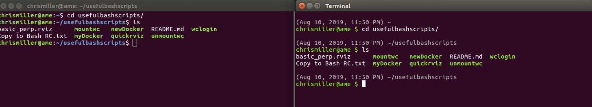

# Useful Bash Scripts 
My personal list of useful bash scripts for grad school. 

 **List of Scripts** 
* *mountwc*   - For mounting the wheelchair working directory over ssh on a remote machine for software development on the remote machine
  * Edit: `chris@wc:/home/chris /mnt/wc` to `yourusername@permpc:home/yourusername /mnt/yourmountdirecory`
  * **Requires sudo to execute: does not autopopulate passwords, yet.**
* *unmountwc* - To unmount the above wheelchair's directory over ssh on a remote machine
* *wclogin*   - To log into the wheelchair over remote and launch byobu
  * Edit: `*yourpasswordhere*` to your wheelchair password and `chris@wc` to `yourusername@permpc`
* *newDocker* - To create a new docker container instance - launch this first when starting a docker. 
   * Edit: `Chris` to the name of your docker container. 
* *myDocker*  - To launch my docker container on the wheelchair - launch this after running newDocker to access your docker container in a new terminal instance
  * Edit: `Chris` to the name of your docker container. 
* *quickrviz* - To launch rviz for the wheelchair 
  * Copy the `basic_perp.rviz` to `.rviz` in your home directory by executing: `cd $HOME/usefulbashscripts && cp basic_perp.rviz $HOME/.rviz`
  
**List of .bashrc Modifications**\
In `Copy to Bash RC.txt` I list some possibly useful ~/.bashrc mods. These are optional and not necessary for using any of the bash scripts listed here. 
* The line referenced in step 5 of installing the bash scripts in this repo
* Improved terminal interface. Left is default, right is new. Use if you like (credit to my friend Ravender for this one).

**Scripts Coming Soon**
* Login to data storage (will require manual password entry)
* Log off of data storage
* Batch video compression of all videos in folder 
* Batch video compression of all videos in folder, copy all videos from folder to specified location on storage, sign out after copy (will require manual login, first)

**Requirements** 
* Install `sshpass` by running `sudo apt-get install sshpass`; [link to sshpass](https://gist.github.com/arunoda/7790979). This is for autologin for logging into the wheelchair and other systems. 
  * **Do not use this for logging into the secure file storage. This stores your password in plaintext and would leave you at risk for identity theft and make our fileshare non-IRB compliant. I will not write scripts with this populated.**
  * Passwords not provided in any scripts need to be manually entered for security. 

**Installation**
1. Ensure all requirements above are met. 
2. Clone this repository into your home directory by running: `cd ~/ && git clone https://github.com/chrisxmiller/usefulbashscripts.git`
3. Check out the list below of scripts and delete any you don't like and delete those you dislike by executing `rm -rf SCRIPTNAMEHERE` for each script.
4. Follow any script-specific edits (as listed above). Don't forget to save the files!
5. Ensure all scripts are executibles by running: `cd $HOME/usefulbashscripts && ls -a`. If all file names are green (sans * .rviz files), all is well. If not, for the non-green files run: `sudo chmod +x FILENAME`.
4. Edit your bashrc so that Ubuntu knows where to find your bash scripts by running `code $HOME/.bashrc` (assumes you're using Visual Studio Code as your text editor. If you're using Sublime use `subl` and if you're using Atom use `atom` in-lieu of `code`). 
5. Append to the bottom of the bashrc file the following line: `export PATH="$HOME/usefulbashscripts:$PATH"`
6. Save the bashrc file, close, and then reopen your terminal. Then, reopen the terminal. 
7. Check that the scripts run by trying to run one of them. Enjoy!

If you have any issues or suggestions, let me know!
